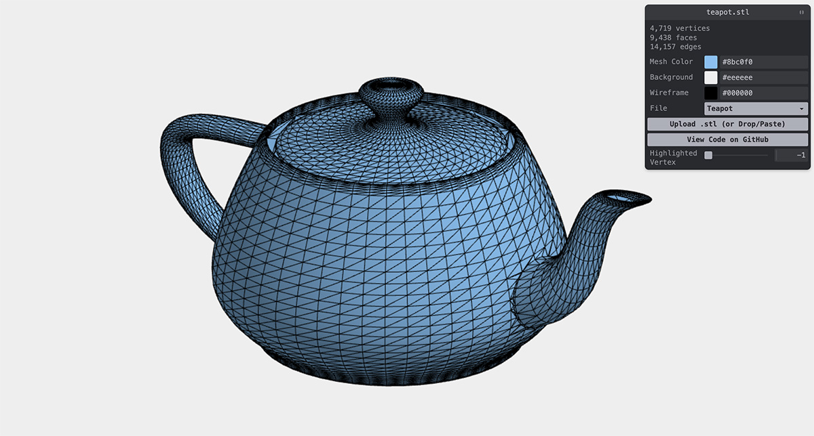

# stl-parser
[](https://apps.amandaghassaei.com/stl-parser/demo/)

[](https://www.npmjs.com/package/@amandaghassaei/stl-parser)
[](https://bundlephobia.com/result?p=@amandaghassaei/stl-parser)
[](https://www.npmtrends.com/@amandaghassaei/stl-parser)
[](https://github.com/amandaghassaei/stl-parser/blob/main/LICENSE.txt)

Standalone module for parsing binary and ASCII STL files – unit tested and written in TypeScript.  Parsing code based on [Threejs STLLoader](https://github.com/mrdoob/three.js/blob/dev/examples/jsm/loaders/STLLoader.js).

Live demo: [apps.amandaghassaei.com/stl-parser/demo/](https://apps.amandaghassaei.com/stl-parser/demo/)


## STL File Format

The .stl file format stores geometry (and sometimes color) information for 3D triangulated meshes.  stl-parser does not generate or render .stl files, but it will allow you to parse them in a browser or nodejs environment.  Example .stl files can be found in [test/stl/](https://github.com/amandaghassaei/stl-parser/tree/main/test/stl).


## Installation

### Install via npm

```sh
npm install @amandaghassaei/stl-parser
```

and import into your project:

```js
import { parseSTL, loadSTL, loadSTLAsync } from '@amandaghassaei/stl-parser';
```

### Import into HTML

Import [stl-parser.js](https://github.com/amandaghassaei/stl-parser/blob/main/dist/stl-parser.js) directly into your html:

```html
<html>
  <head>
    <script src="stl-parser.js"></script>
  </head>
  <body>
  </body>
</html>
```

`STLParserLib` will be accessible globally:

```js
const { parseSTL, loadSTL, loadSTLAsync } = STLParserLib;
```


## Use

```js
// Load and parse the .stl file using url or File object.
loadSTL('./teapot.stl', (mesh) => {
  const {
    vertices,
    faceNormals,
    faceColors,
    edges,
    boundingBox,
  } = mesh;
});
// Also try:
// const mesh = await loadSTLAsync('./teapot.stl');

// Or parse file buffer or string synchronously.
const meshFromBuffer = parseSTL(fs.readFileSync('./teapot.stl'));
const meshFromString = parseSTL(`solid ASCII
  facet normal 0.000000e+00 0.000000e+00 -1.000000e+00
    outer loop
      vertex   1.000000e+01 0.000000e+00 -1.000000e+01
      vertex   0.000000e+00 0.000000e+00 -1.000000e+01
      vertex   1.000000e+01 1.000000e+01 -1.000000e+01
    endloop
  endfacet
  ....
  facet normal 0.000000e+00 -1.000000e+00 0.000000e+00
    outer loop
      vertex   0.000000e+00 0.000000e+00 0.000000e+00
      vertex   1.000000e+01 0.000000e+00 -1.000000e+01
      vertex   1.000000e+01 0.000000e+00 0.000000e+00
    endloop
  endfacet
endsolid`);
```

- `vertices` is an array of length 3 * numVertices containing a flat list of vertex positions in the following order `[x0, y0, z0, x1, y1, z1, ...]`.  Each group of three vertices make up a triangle in the .stl mesh (by default, vertices are not shared between triangles in the .stl format, see `mergeVertices()` below).
- `faceNormals` is an array of length 3 * numFaces containing a flat list of face normals in the following order `[nx0, ny0, nz0, nx1, ny1, nz1, ...]`
- If available, `faceColors` is an array of length 3 * numFaces containing a flat list of face colors in the following order `[r0, g0, b0, r1, g1, b1, ...]`.
- `edges` is an array containing all unique edges (expressed as pairs of vertex indices) in the mesh in the following order: `[e01, e02, e11, e12, ...]`.  `edges` is calculated when queried and then cached.
- `boundingBox` returns the min and max of the mesh's bounding box, and is in the form: `{ min: [x, y, z], max: [x, y, z] }`.  `boundingBox` is calculated when queried and then cached.


The resulting mesh object returned by `parseSTL`, `loadSTL`, and `loadSTLAsync` also exposes methods for modifying its geometry:

```js
mesh.mergeVertices().scaleVerticesToUnitBoundingBox();
const { faceIndices } = mesh;
```

- `STLMesh.mergeVertices()` merges coincident vertices and adds a `faceIndices` array to the mesh object.  `faceIndices` has length 3 * numFaces and contains a flat list of triangle face vertex indices in the following order: `[v01, v02, v03, v11, v12, v13, ...]`.
- `STLMesh.scaleVerticesToUnitBoundingBox()` scales the `vertices` values (in place) to fit inside a unit box and centered around the origin.


## Limitations

- See limitations listed in [Threejs STLLoader](https://github.com/mrdoob/three.js/blob/dev/examples/jsm/loaders/STLLoader.js).  If you have a file that is not being parsed correctly, please upload it to [Issues](https://github.com/amandaghassaei/stl-parser/issues) to it can be added as a test case.  Pull requests welcome.


## Acknowledgements

- This is a TypeScript port of the [STLLoader](https://github.com/mrdoob/three.js/blob/dev/examples/jsm/loaders/STLLoader.js) class from [Threejs](https://github.com/mrdoob/three.js).


## License

This work is licensed under an [MIT License](https://github.com/amandaghassaei/stl-parser/blob/main/LICENSE.txt).


## Development

I don't have any plans to continue developing this package, but I'm happy to review pull requests if you would like to add a new feature / fix a bug.

To install dev dependencies:

```sh
npm install
```

To compile `src` to `dist`:

```sh
npm run build
```

### Testing

To run tests:

```sh
npm run test
```
